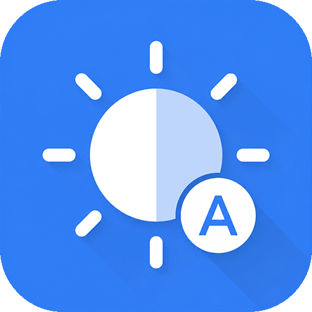

# SmartBrightness



**智能自动亮度**是一款安卓亮度调节工具，主要功能为根据当前环境光亮度自动开关系统自动亮度功能，支持 **Shizuku** 和 **Root** 两种模式。

## 🌟 主要功能

*   **智能环境检测**：屏幕点亮时及定时重复检测环境光强度 (Lux)，根据预设阈值自动开关自动亮度。
*   **双模式支持**：
    *   **Shizuku 模式**：无需 Root 权限即可执行底层 Shell 命令进行亮度控制。
    *   **Root 模式**：为已解锁的设备提供更直接的控制。
*   **自动恢复功能**：当环境光恢复到特定范围时，自动恢复之前的亮度设置。
*   **可自定义阈值与间隔**：用户可以根据个人偏好调整检测灵敏度和频率。
*   **实时日志查看**：内置日志系统，方便查看传感器数据。
*   **轻量化运行**：作为前台服务运行，非实时监听，资源占用极低，省电高效。

## 🚀 快速开始

### 准备工作

1.  **Shizuku (推荐)**：
    *   确保您的设备已安装并激活 [Shizuku](https://shizuku.rikka.app/)。
    *   在应用内授权 智能自动亮度 使用 Shizuku 权限。
2.  **Root**：
    *   如果您的设备已 Root，也可以直接选择 Root 模式运行。

### 使用步骤

1.  下载并安装 SmartBrightness APK。
2.  打开应用，根据提示授予必要的权限（Shizuku/Root 权限、通知权限）。
3.  在“设置”页面配置您的环境光阈值 (Threshold) 和检测间隔 (Interval)，设为 `0` 则禁用定时检测。
4.  开启主页顶部的“总开关”，即可开始享受智能亮度调节。

## 🛠️ 开发与架构

*   **传感器管理**：利用 `Sensor.TYPE_LIGHT` 获取高精度环境光数据。
*   **命令执行**：通过 `ShellExecutor` 封装了 Shizuku 和 Root 模式下的命令执行逻辑。
*   **后台常驻**：通过 `BrightnessService`（前台服务）保证在后台持续监控环境光。

## 📂 项目结构

```text
com.onedongua.smartbrightness
├── adapter              # UI 适配器
├── brightness           # 亮度控制核心逻辑
├── executor             # Shell 命令执行器
├── log                  # 应用内日志记录系统
├── receiver             # 屏幕状态监听
├── sensor               # 环境光传感器管理
├── service              # 核心后台服务
├── settings             # App 配置持久化
├── utils                # 工具类
├── BaseApplication.java # 应用入口
└── MainActivity.java    # 主界面
```

## 🤝 贡献

如果您有任何好的想法或发现了 Bug，欢迎提交 Issue 或 Pull Request。

## 📄 许可证

本项目使用 [Apache License 2.0](./LICENSE.txt) 许可证